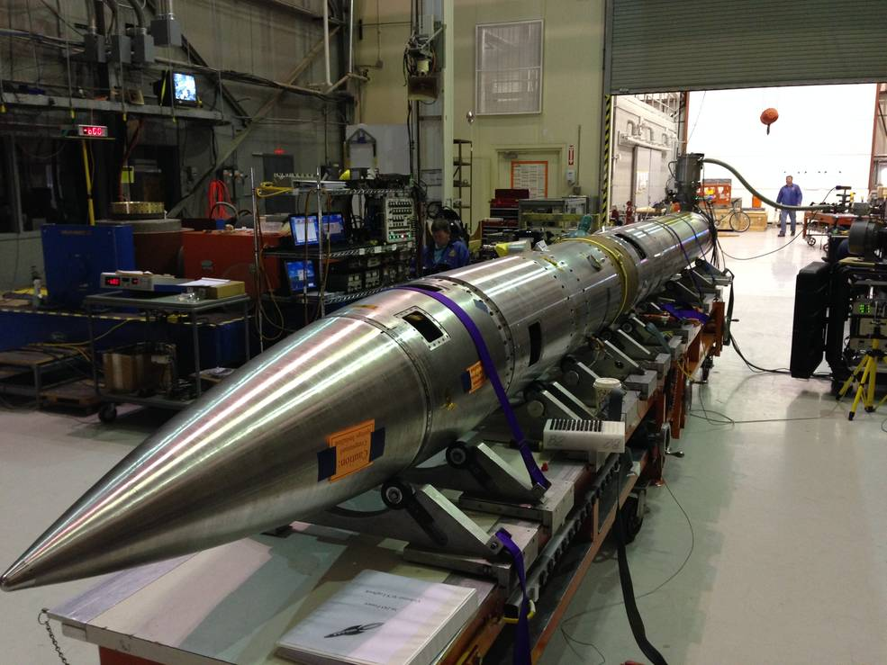

CHESS_pipeline
==============
 
 
This software is intended to serve as a data reduction pipeline for
the CHESS (Colorado High-resolution Echelle Stellar Spectrograph)
instrument. More information can be found at
http://uvrockets.colorado.edu

